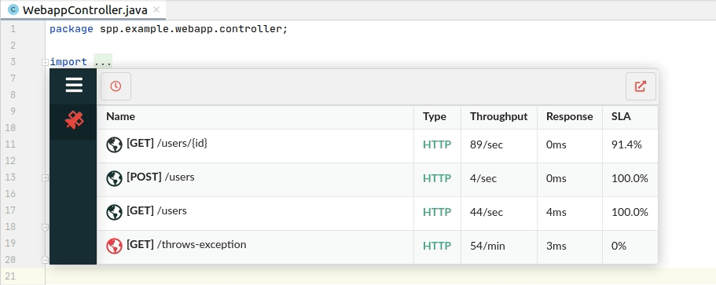
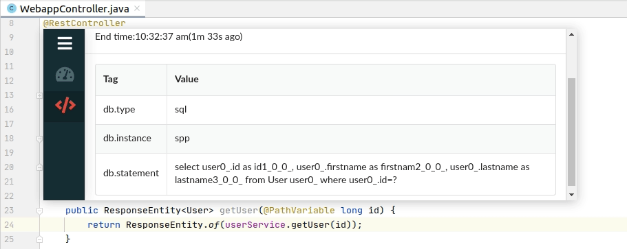

# Introduction

SourceMarker is a JetBrains-powered plugin which provides continuous feedback capabilities via integration with [Apache SkyWalking](https://github.com/apache/skywalking). SourceMarker increases software development productivity via the Feedback-Driven Development (FDD) approach, a methodology of combining IDE and APM technology to create tighter feedback loops. As operating software in the cloud becomes easier, the process of building and operating software tends to be more aligned. This trend makes it increasingly necessary for programming environments to not just support development-centric activities, but operation-centric activities as well. Traditionally, software developers create software inside of their IDEs, yet operate and monitor that software via dashboards and reports provided by their APMs. By combining these two technologies, software developers can intuitively explore multiple dimensions of their software without the context switches normally created by switching back and forth from source code to graphs, reports, and websites.


## SourceMarker

### Installation

#### Using IDE built-in plugin system:

  <kbd>Preferences</kbd> > <kbd>Plugins</kbd> > <kbd>Marketplace</kbd> > <kbd>Search for "SourceMarker"</kbd> > <kbd>Install Plugin</kbd>

#### Manually:

  Download the [latest release](https://github.com/sourceplusplus/SourceMarker/releases/latest) and install it manually using
  <kbd>Preferences</kbd> > <kbd>Plugins</kbd> > <kbd>⚙️</kbd> > <kbd>Install plugin from disk...</kbd>


### Configuration

SourceMarker requires a few key configuration settings before it can be fully utilized.

The SourceMarker configuration settings can be found at: <kbd>Settings</kbd> > <kbd>Tools</kbd> > <kbd>SourceMarker</kbd>


The primary configuration is the location of the Apache SkyWalking OAP (Observability Analysis Platform). This setting is configured on a per-project basis and allows SourceMarker to gather production runtime information which it uses to augment source code. SourceMarker should also be provided with the root source package of your project. This setting can typically be automatically detected but if not can be manually input. This setting is primarily used to ensure any source code analysis is only performed on relevant source code.


## Source Mark

*Source Marks* are one of the central components of SourceMarker. *Source Marks* are used to give developers a quick indication about the current behavior of a given source code artifact. These markings are placed in and around source code text to indicate there is additional information that can be viewed about that specific source code artifact.


### Gutter Mark

*Gutter Marks* represent the first of the two types of *Source Marks* available. *Gutter Marks* are distinguished by the fact that they do not occur directly inside source code but rather on the side of source code in an area known as the gutter. Typically, the gutter is to the left of source code and is often where line numbers are displayed. *Gutter Marks* are icon-based symbols that are interpreted through the icon which is displayed and context/location in which they are displayed. To get the complete meaning behind any *Gutter Mark* simply click it and the *Source Portal* will appear with the full context.

|        |
| :----------------------------------------------------------: |
| *Gutter Mark indicating the userList() method is suffering from degrading runtime performance* |


### Inlay Mark

*Inlay Marks* represent the second of the two types of *Source Marks* available. Unlike *Gutter Marks*, *Inlay Marks* are positioned directly before, inside of, after, or above textual source code. Whereas *Gutter Marks* are primarily used to convey information about entire classes, methods, and lines, *Inlay Marks* are primarily used to convey information about specific expressions, arguments, and variables. To get the complete meaning behind any *Inlay Mark* simply click it and the *Source Portal* will appear with the full context.

|            |
| :----------------------------------------------------------: |
| *Inlay Mark tracking the latest production occurrence of an exception occurring on line 54* |


## Source Portal

The *Source Portal* is the primary visual interface of SourceMarker. It is a dynamic and contextual interface that displays visualizations relevant to the source code currently in focus. The *Source Portal* is used to convey larger amounts of relevant runtime information than is possible through *Source Marks*.

To view the *Source Portal* you can click any visible *Source Mark* or you can type the keyboard combination:

```
CONTROL+SHIFT+S
```

Doing so will trigger the *Source Portal* to display directly above the artifact for which the information correlates, like so:


Given that the *Source Portal* is a contextual interface, there are a few different views which you may see once you've triggered the *Source Portal*.


### Overview

The Overview view displays general endpoint, service, and database statistics giving an overall view for the entire class. This is the default view of the *Source Portal* when triggered in the context of a source code class. This view displays each method of the class representing endpoints (e.g. `@RequestMapping`) in the class will be represented in this view.




### Activity

The Activity view displays general artifact statistics to gather an overall view of a source code artifact's runtime behavior. The Activity view displays the artifact's throughput, response time, and SLA (service level agreement). Each of these settings may be clicked to change the displayed graph for more detailed viewing. This view also contains temporal configuration settings so different time ranges can be viewed for each of these statistics.


### Traces

The Traces view is used to navigate gathered distributed traces. The Traces view is able to display the latest, slowest, and failed traces for a given source code artifact.


#### Trace Stack

Clicking on any trace


#### Span Info


